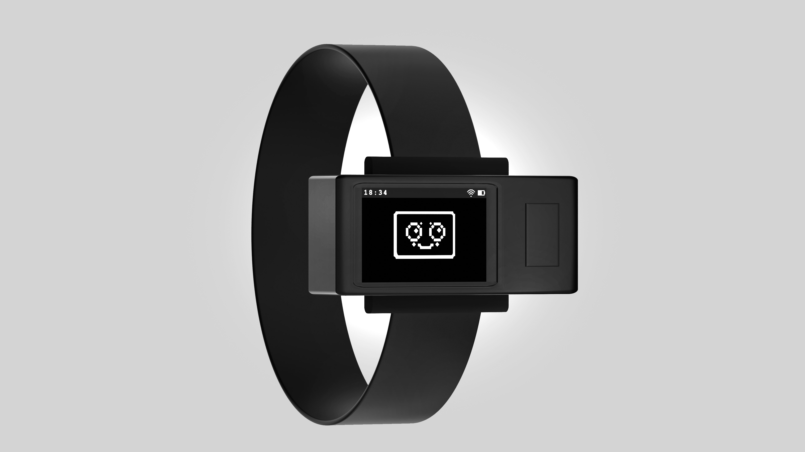

# Anne Wear

[Project Info](https://eliasalerno.ch/work/anne)

Anne Wear is a playful, user-first, personalized companion for children with ADHD, combining proven teaching methods, artificial intelligence, and haptic feedback.

## Features

> This project has been built specifically for the M5StickCPlus2, which is based on the ESP32 pico and the PlatformIO framework.

- **Task Management**: Helps children manage tasks effectively with visual and haptic cues.
- **Personalized Interaction**: Adapts to individual needs using AI algorithms.
- **Audio Capabilities**: Supports voice input and provides audio feedback with a buzzer.
- **Connectivity**: Connects to Wi-Fi and communicates with a server for synchronization.
- **User Interface**: Offers engaging animations and a user-friendly interface, with a composer widget that allows to create custom notification sounds.
- **Battery Management**: Monitors battery levels and optimizes power usage.


## Installation

1. **Clone the Repository**

   ```bash
   git clone https://github.com/salernoelia/anne-wear.git
   ```

2. **Install Dependencies**

   Install all required libraries in your development environment. If you use PlatformIO, it handles this task for you.

3. **Upload the Firmware**

   - Connect the M5StickC Plus device to your computer.
   - Flash the anne wear Firmware.

4. **Connect to the AP created and update the credentials**

    - When you connect to the AP of the anne wear, you can visit `http://192.168.4.1/`on a browser to configure the device and connect it to the [anne Hub](https://github.com/salernoelia/anne-hub)

## License

This project is licensed under the MIT License.
